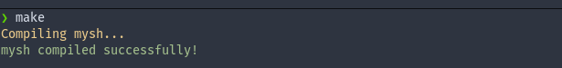
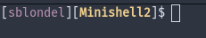

# Minishell2

## GENERAL INFO

In this project, you are asked to create a Unix shell program that will
interpret and execute commands entered by the user.
The purpose of this project is to learn how to manipulate processes,
pipes and signals in a Unix environment.

The basic features of minishell2 are as follows:

* Display a prompt when waiting for a command.
* Handle basic commands like cd, env, setenv and unsetenv.
* Handle the execution of commands located in the PATH variable.
* Handle pipes and redirections.
* Handle signals and exit status.

Being able to manage processes, pipes,
signals and file descriptors are key skills when you want to develop a shell program.

## AUTHORIZED FUNCTIONS

#### From the C library
* access
* chdir
* close
* dup
* dup2
* execve
* exit
* fork
* free
* getcwd
* getenv
* kill
* malloc
* open
* pipe
* read
* signal
* stat
* strerror
* wait
* waitpid
* write

#### From the POSIX library

* strtok

#### Other functions

* isatty
* ioctl
* ttyname

Note that any functions not mentioned in the authorized list are forbidden.

## HOW TO USE

#### Compilation

then run the executable with: `./mysh`

#### Shell prompt

